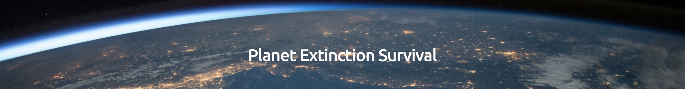

# PP2 - Planet Extinction Survival
Planet Extinction Survival is a made-up game where the world is about to end and the only one to have yourself is by proving to the AI who has travelled to earth that you can do simple maths. This game is aimed at young adults and adults who have an interest in space, AI and extinction theories and want to test their mental artithmetic skills.

The site is fully responsive Javascript game where depending on how many questions the user gets right or wrong will depend on the outcome of the game.

[IS MY SITE RESPONSIVE IMAGE]

The site is deployed here:

## Planning

I then created wireframes using Balsamiq to have a structure to work from when building the actual site. Here are my wireframes

### Home

### Survival outcome

### Death outcome

## Existing Features

## index.html page

### Background

The site has a background that covers the window and is coded directly into the html in style.css. The background is fixed so the user always sees this background. An image of the earth from space was used to help the user journey in getting into the spirit of the game.

### Header

The header is a simple text header which sits nicely on top of the background image above the main game area. This header stays in the same place throughout the user journey. This is intended to keep the user familiar with the overall site at all times.

For medium and smaller screens, the header is responsives and collapes onto 3 lines centred.

### Game Introduction

When the page first loads there is an area with a different background centered in the middle of the background which includes a title, introductory text and a button with a call-to-action asking the user to start the quiz. This is intended to introduce the user to the backstory to the game and takes them on the journey as if this was a real-life situation.

### Quiz game

Once the user has clicked 'Start Quiz' the JavaScript (JS) maniuplates the DOM and turns off the introductory title and text and replaces it with the quiz and intructions for completing the quiz. The quiz remains in the same area as the introductory text and title when the page was first loaded to ensure a consistent user journey.

### Survival Outcome

The final content section again follows a similar style to the two previous sections. I flipped the text and image around again. This time I also introduced a grid of four captioned images to represent some of the services I am discussing in the text content. Again, this styling was aiming to break up the sections and make them more visually pleasing. I included two CTA's in this section - one to take the user to a gallery of example photography and the key CTA to get in touch again. For medium and smaller screens, the image appears stacked on top of each other and below the heading and text content in this instance.

### Death Outcome

The footer section is at the bottom of every page and contains links to social media. Inspiration for this was taken from the Love Running project as I think the minimal sleek Font Awesome icons look great. An extra navigation link to the Contact page is also included as a learned behaviour overtime (especially from corporate sites) is to find contact info in the footer. I felt that the key CTA for users is for them to get in contact to book so repeating the CTA felt worthwhile again here. For medium and smaller screens, the footer reduces in height by 50% to not take up too much space on the screen. Visually it looks much nicer also.

## Future Features

There are changes/features I would like to include in future. For example:

* Replace quiz table with a random auto-generated question that automatically loads the next question once answered. I think this would be more visually pleasing to the user.

## Testing

### Browser Testing

I tested the site in Google Chrome, Safari and Firefox and the site renders the same across all three.

### HTML Validation

I validated the HTML for the site using: https://validator.w3.org/. The result of my validation can be seen here: https://validator.w3.org/nu/?doc=https%3A%2F%2Fladcode2021.github.io%2Ffirst-photography-pp1%2F

One warning was found:
 

I have chosen not to address this warning as this section is an image only section. It does not require a heading. I appreciate this is non-conventional as generally a section has a heading. But I still felt that this is a section in the semantic make-up of the page.

### CSS Validation

I validated the CSS using: https://jigsaw.w3.org/css-validator/. The result of my validation can be seen here: https://jigsaw.w3.org/css-validator/validator?uri=https%3A%2F%2Fladcode2021.github.io%2Ffirst-photography-pp1%2F&profile=css3svg&usermedium=all&warning=1&vextwarning=&lang=en

No validation errors were found.

### Lighthouse Testing

I generated a Lighthouse report in Chrome dev tools to see how accessible my site is. I recieved a 97 which I was very pleased with:

## Deployment

I deployed First Photography via GitHub pages following these steps:

1. Click settings in the navigation menu
2. Click pages in the menu on the left
3. Select Main branch
4. Select Root
5. Click save

This resulted in my site being deployed on this URL:

https://ladcode2021.github.io/first-photography-pp1/

## Credits

### Code Credits

Where I used code, I picked up in articles or tutorials in external resources I have marked it in the html or css. Here is a list of all the code I adapted from external sources:

Some JS code adapated from Love Math walkthrough project.

Button centering very loosely based on: https://www.w3schools.com/howto/howto_css_center-vertical.asp

### Image Credits

I solely used Pexals and here is all of the images I used:

Background image: https://www.pexels.com/photo/planet-earth-220201/
Volcano image: https://www.pexels.com/photo/iceland-snow-landscape-nature-8905098/

### Video Credits

Video used from SpaceX YouTube channel: https://www.youtube.com/watch?v=WZvtrnFItNs

