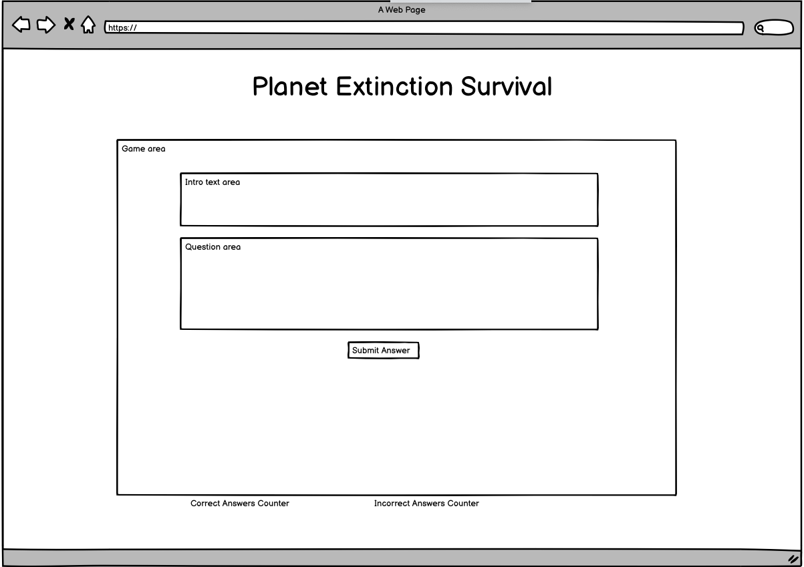
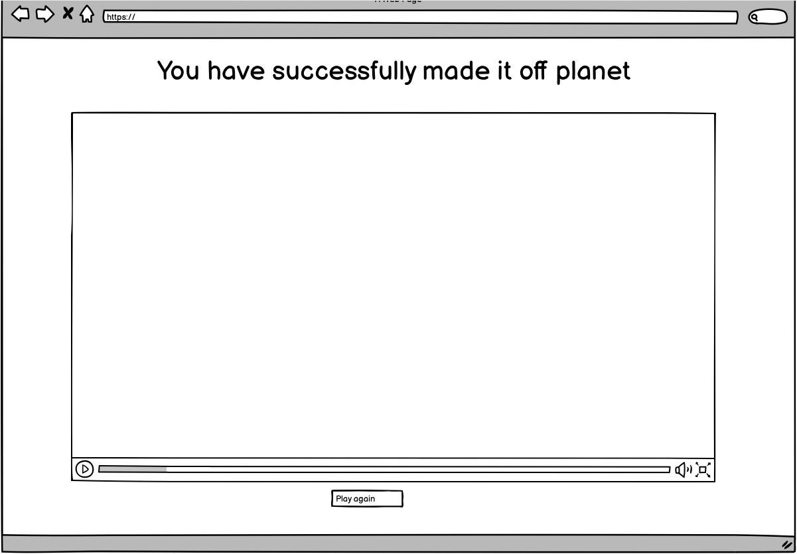
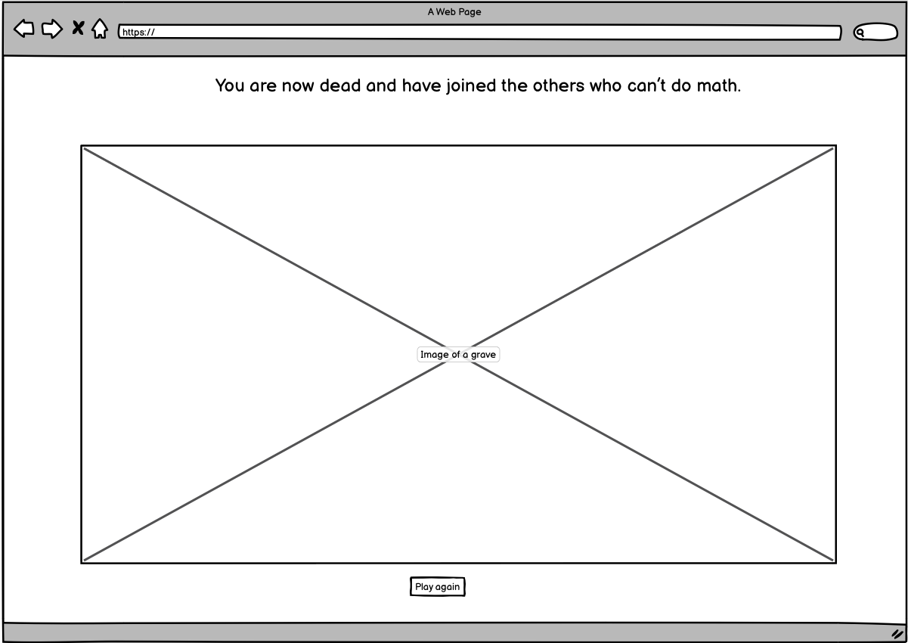

# PP2 - Planet Extinction Survival
Planet Extinction Survival is a made-up game where the world is about to end and the only one to have yourself is by proving to the AI who has travelled to earth that you can do simple maths. This game is aimed at young adults and adults who have an interest in space, AI and extinction theories and want to test their mental artithmetic skills.

The site is fully responsive Javascript game where depending on how many questions the user gets right or wrong will depend on the outcome of the game.

[IS MY SITE RESPONSIVE IMAGE]

The site is deployed here:

## Planning

I then created wireframes using Balsamiq to have a structure to work from when building the actual site. Here are my wireframes

### Home

### Survival outcome

### Death outcome

## Existing Features

## index.html page

### Header

#### Logo

The logo is styled text using .css and is floated left on all pages in the header section but will become centred on smaller screen sizes. This way of creating a logo was picked up in the Love Running project.

The navigation bar is fully responsive also and is floated right on all pages and will allow the user to navigate to the following pages:

* Home
* Gallery
* Contact

For medium and smaller screens, the navigation bar centres below the logo.

The pseudo hover CSS class has been used along with an active class when the user is on each page to show which page in the navigation they are on. The navigation bar will also show on all four pages so the user can easily navigate around the site wherever they are.
See logo and navigation below:

#### Banner

The banner image displays below the header section (i.e. below the logo and the navigation bar). The intention with the banner image is for the user to be drawn into an emotional response when they first hit the site, ensuring they continue to browse and eventually get in touch to book their own photoshoot. The banner image also scales responsively for medium to smaller screens.

### About First Photography

This section introduces First Photography and includes a sample image. This spans the width of the screen instead of 50% as I'd originally planned in the wireframe. Once I'd made the initial structure, I didn't like how word heavy it would have been with two text sections side-by-side, so I decided to go with text on the left and an image to the right for this section. The key call-to-action (CTA) on this site in its current iteration is to get in touch to book a photoshoot so I introduced the CTA as soon as I could on the page in this section. For medium and smaller screens, the image appears below the heading and above the text content.

### About me

This section introduces the photographer, John Smith. I styled this the same as the previous section but flipped round the text to be on the left and the image to be on the right. I also gave it a background colour in-line with the colour scheme to break up the sections and provide a more visually pleasing experience for the user. For medium and smaller screens, the image appears below the heading and above the text content.

### Services

The final content section again follows a similar style to the two previous sections. I flipped the text and image around again. This time I also introduced a grid of four captioned images to represent some of the services I am discussing in the text content. Again, this styling was aiming to break up the sections and make them more visually pleasing. I included two CTA's in this section - one to take the user to a gallery of example photography and the key CTA to get in touch again. For medium and smaller screens, the image appears stacked on top of each other and below the heading and text content in this instance.

### Footer section

The footer section is at the bottom of every page and contains links to social media. Inspiration for this was taken from the Love Running project as I think the minimal sleek Font Awesome icons look great. An extra navigation link to the Contact page is also included as a learned behaviour overtime (especially from corporate sites) is to find contact info in the footer. I felt that the key CTA for users is for them to get in contact to book so repeating the CTA felt worthwhile again here. For medium and smaller screens, the footer reduces in height by 50% to not take up too much space on the screen. Visually it looks much nicer also.

## gallery.html page

The header from index.html is repeated on this page for consistency and navigational continuity for the user. I learnt during the IDE module that once a user sees your homepage, they have already learned about your site so by keeping continuity makes it more likely the user will spend longer on the site.

There is a selection of images taken from Pexels (see Credit section) to represent images the imaginary photographer has taken on previous shoots. The idea behind this is to encourage the user to see photography and be inspired to book in for similar shoots. They are structured in a six 4 row six column structure. I felt this fit large screen widths well. I achieved this using Flexboxes. For medium and smaller screens, the images appear stacked on top of each other. I would have preferred it if there was 2 images side-by-side but from what I could ascertain I would have had to re-code the whole gallery. I learnt a valuable lesson here and in future will take a mobile first approach.

The footer section is also repeated here for user consistency to again keep reinforcing the CTA's.

## contact.html page

The header from index.html is repeated on this page as well and again this is for consistency and navigational continuity for the user.

The contact form is aligned to the centre of the page, so the user is drawn straight to it as it is the only content available. I have made all the fields required and included a submit button and a reset form button. So the form can be tested and proved I created a thank-you.html page. When the user fills out the contact form it directs to this page. For medium and smaller screens, the form scales responsively and fills a nice portion of the screen on all screen sizes ensuring the message box isn't unreadable when typing.

The footer section is also repeated on both the contact.html page and thank-you.html page for user consistency to again keep reinforcing the CTA's.
Screenshot of contact page:

Screenshot of thank you page:

## Future Features

There are plenty of features I would like to include in future. For example:

* Replace Flexbox on gallery.html page with an image collection learned and created in javascript
* Learn and use grid to replace the Flexbox for the services section images on index.html
* Give the user the ability to book appointments, pay for services, purchase stock imagery, access private final repository of their shoots and leave reviews.

## Testing

### Browser Testing

I tested the site in Google Chrome, Safari and Firefox and the site renders the same across all three.

### HTML Validation

I validated the HTML for the site using: https://validator.w3.org/. The result of my validation can be seen here: https://validator.w3.org/nu/?doc=https%3A%2F%2Fladcode2021.github.io%2Ffirst-photography-pp1%2F

One warning was found:
 

I have chosen not to address this warning as this section is an image only section. It does not require a heading. I appreciate this is non-conventional as generally a section has a heading. But I still felt that this is a section in the semantic make-up of the page.

### CSS Validation

I validated the CSS using: https://jigsaw.w3.org/css-validator/. The result of my validation can be seen here: https://jigsaw.w3.org/css-validator/validator?uri=https%3A%2F%2Fladcode2021.github.io%2Ffirst-photography-pp1%2F&profile=css3svg&usermedium=all&warning=1&vextwarning=&lang=en

No validation errors were found.

### Lighthouse Testing

I generated a Lighthouse report in Chrome dev tools to see how accessible my site is. I recieved a 97 which I was very pleased with:

## Deployment

I deployed First Photography via GitHub pages following these steps:

1. Click settings in the navigation menu
2. Click pages in the menu on the left
3. Select Main branch
4. Select Root
5. Click save

This resulted in my site being deployed on this URL:

https://ladcode2021.github.io/first-photography-pp1/

## Credits

### Code Credits

Where I used code, I picked up in articles or tutorials in external resources I have marked it in the html or css. Here is a list of all the code I adapted from external sources:

hr styling script taken from https://www.prodjex.com/2019/03/match-hr-width-to-text-above/

Footer code taken from Love Running project and adapted. 

Font Awesome used for footer icons.

Form stacking CSS adapated from: https://www.w3schools.com/howto/howto_css_stacked_form.asp

Some styling properties for form buttons taken from: https://www.w3schools.com/css/tryit.asp?filename=trycss_form_button

Some Flexbox code adapted from https://spin.atomicobject.com/2016/06/18/vertically-center-floated-elements-flexbox/ for main sections

### Image Credits

I solely used Pexals and here is all of the images I used:

Background image: https://www.pexels.com/photo/planet-earth-220201/

