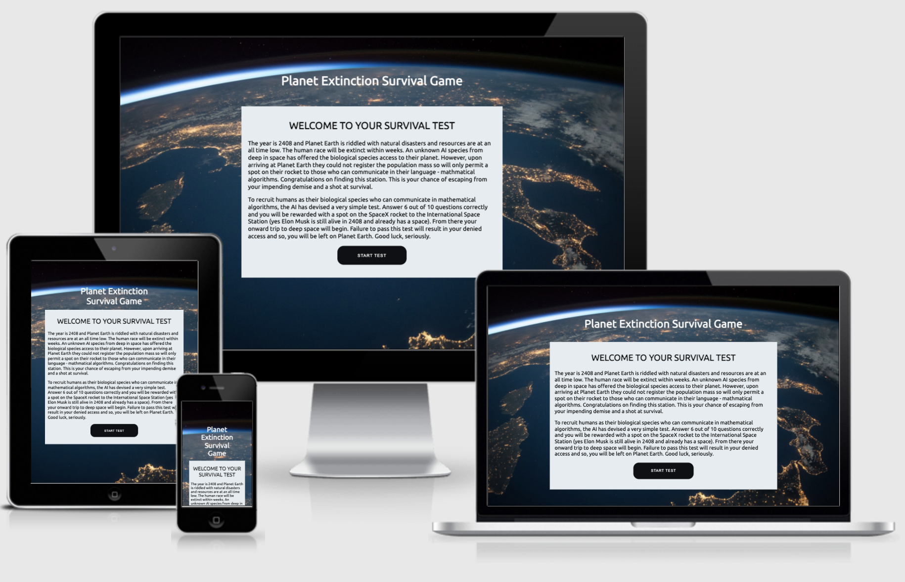

# PP2 - Planet Extinction Survival
Planet Extinction Survival is a made-up game where the world is about to end and the only one to save yourself is by proving to the AI who has travelled to earth that you can do simple maths. This game is aimed at young adults and adults who have an interest in space, AI and extinction theories and want to test their mental artithmetic skills.

The site is fully responsive Javascript game and depending on how many questions the user gets right or wrong will depend on the outcome of the game.

The site is deployed here: https://ladcode2021.github.io/pp2-planet-extinction-survival/

## Planning

I created wireframes using Balsamiq to have a structure to work from when building the actual site. Here are my wireframes

### Home

### Survival outcome

### Death outcome

## Existing Features

## index.html page

### Background

The site has a background that covers the window and is coded directly into the html tag in style.css. The background is fixed so the user always sees this background regardless of scrolling. An image of the earth from space was used to help the user journey in getting into the spirit of the game.

### Header

The header is a simple text header which sits nicely on top of the background image above the main game area. This header stays in the same place throughout the user journey. This is intended to keep the user familiar with the overall site at all times.

For medium and smaller screens, the header is responsives and collapes onto 3 lines centred.

### Game Introduction

When the page first loads there is an area in the middle of the main background differntiated by a plain white background which includes a title, introductory text and a button with a call-to-action asking the user to start the game. This is intended to introduce the user to the backstory to the game and takes them on the journey as if this was a real-life situation.

For smaller and medium screens the area is responsonsive.

### Quiz game

Once the user has clicked 'Start Game' the JavaScript (JS) maniuplates the DOM and turns off the introductory title and text and replaces it with the quiz table and intructions for completing the quiz. The quiz remains in the same area as the introductory text and title when the page was first loaded to ensure a consistent user journey.

Once a user enters an answer to a question using JavaScript the site automatically validates the answer once they leave the input field. If the answer is correct the input field is disabled and is coloured green. If the user asnwers incorrectly the input field is disabled and coloured red. Correct and incorrect scores are also automatically incremented below the quiz so the user can keep track of how they are doing.

For smaller and medium screens the quiz table scales well until it reaches screens below 320px. To account for this there is a media query which reduces font-size and padding to continue being responsive under 320px.

### Survival Outcome

If the user enters 6 questions correctly JavaScipt again manipulates the DOM and replaces all of the content with a congratulatory message and a video of a SpaceX rocket lifting off to simulate the user making it off planet. The video is set to auto-play but this is disable by some browsers, i.e. Google Chrome.

The user also has the option to restart the game with a button centered below the video.

The page is still fully responsive and the video reduces in height for smaller and medium screens.

### Incorrect Outcome

If the user enters 6 questions incorrectly JavaScipt again manipulates the DOM and replaces all of the content with a message telling the user to try again and a picture of a man observing an erupted volcano to simulate the user being left on the dying planet.

The user also has the option to restart the game with a button centered below the video.

The page is still fully responsive and the image automatically scales for smaller and medium screens.

## Future Features

There are changes/features I would like to include in future. For example:

* Replace quiz table with a random auto-generated question that automatically loads the next question once answered. I think this would be more visually pleasing to the user.
* Have a larger range of questions so game lasts longer and can be played multiple times. This would also be made possible with auto generation of questions. It would be too verbose in the current table structure to have more questions.

## Testing

* I confirmed that the game results are always correct.
* I asked a family member to test they could run the game without issues.

### Bugs

When a family member tested the game they found that if they answered '0' it was not registered or validated by the game. This can be seen below:

I manged to fix this by changing the conditions upon which the JavaScipt is triggered to run the checkAnswer() function. Previous to this an if condition was set to do nothing if the input boxes were '== 0' to allow the user to click in and out of boxes without registering them as incorrect scores before they'd inputted an answer. This was because the event listener is set to run the checkAnswer function when a user leaves the input field. To fix this I changed the '== 0' to '=== null' to stop it checking for 0 at all. This did re-introduce the problem that if a user clicked in and out of a box without inputting an answer it would mark it as wrong an incremenet a wrong answer. To fix this I changed the proceedoing else if to run the checkASnswer function if the value of the answer was greater than or = to 1 ('val.length >= 1'). The final JavaScript code is illustrated below:

### Browser Testing

I tested the site in Google Chrome, Safari and Firefox and the site renders the same across all three. The video on winning the game does not auto-play in Chrome and Firefox as it has sound. I was able to get this to work in Firefox by changing my Firefox browers settings to allow autoplay.

### HTML Validation

I validated the HTML for the site using: https://validator.w3.org/. I did initially recieve an error becuase I had frameborder properties in a video iframe. The code for the iframe is supplied by YouTube interestingly.

I removed this property and re-ran the validation and the result of my validation can be seen here: https://validator.w3.org/nu/?doc=https%3A%2F%2Fladcode2021.github.io%2Fpp2-planet-extinction-survival%2F. No validation errors were found.

### CSS Validation

I validated the CSS using: https://jigsaw.w3.org/css-validator/. I did initially recieve a 'parse' error. This was due to me not closing out my first set of media queries correctly.

I fixed this error by closing out the media query correctly and re-ran the validation and the result of my validation can be seen here: https://jigsaw.w3.org/css-validator/validator?uri=https%3A%2F%2Fladcode2021.github.io%2Fpp2-planet-extinction-survival%2F&profile=css3svg&usermedium=all&warning=1&vextwarning=&lang=en. No validation errors were found.

### Javascript Validation

I validated the JavaScript using: https://jshint.com. It produced 0 errors but did give 4 warnings. All of them were this: 'Functions declared within loops referencing an outer scoped variable may lead to confusing semantics.' I decided not to try to fix these warnings as the warning is coming from code I adapted from the Love Maths walkthrough project. The tutor in one of the videos also recieves this warning and says there is a workaround but it goes into JavaScript concepts we haven't yet been taught yet.

### Lighthouse Testing

I generated a Lighthouse report in Chrome dev tools to see how accessible my site is. I recieved a 100 which I was very pleased with:

## Deployment

I deployed First Photography via GitHub pages following these steps:

1. Click settings in the navigation menu
2. Click pages in the menu on the left
3. Select Main branch
4. Select Root
5. Click save

This resulted in my site being deployed on this URL: https://ladcode2021.github.io/pp2-planet-extinction-survival/

To run this site locally, you can clone this repository directly into the editor of your choice by pasting git clone https://github.com/LADCode2021/pp2-planet-extinction-survival.git into your terminal. To stop using the existing GitHub repository, type git remote rm origin into the terminal.

## Credits

### Code Credits

Where I have used code I picked up in articles or tutorials in external resources I have marked it in the HTML, CSS and JavaScript. Here is a list of all the code I adapted from external sources:

Some JS code adapated from Love Math walkthrough project.

Button centering very loosely based on: https://www.w3schools.com/howto/howto_css_center-vertical.asp

### Image Credits

I solely used Pexals and here are all of the images I used:

Background image: https://www.pexels.com/photo/planet-earth-220201/
Volcano image: https://www.pexels.com/photo/iceland-snow-landscape-nature-8905098/

### Video Credits

Video used from SpaceX YouTube channel: https://www.youtube.com/watch?v=WZvtrnFItNs

